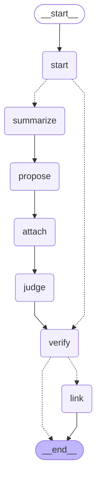
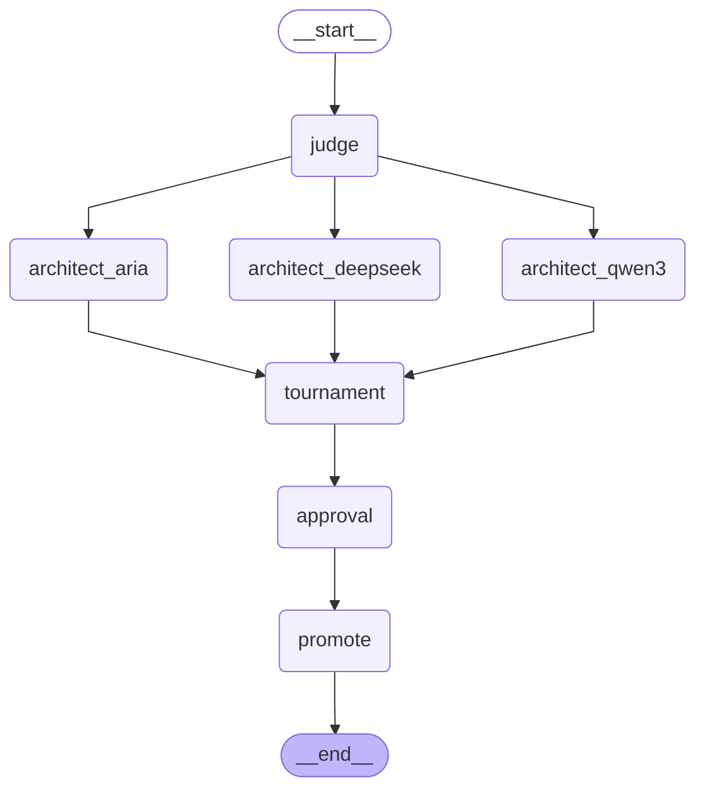

# Helix as state graphs

Generated by `python -m helix.orchestrate mermaid`. Nodes call the same functions as `loop.py` and `helix/product.py`; the graph adds checkpointing (resume from the last completed node), fan-out for the architects, and an approval interrupt before a rulebook is promoted.

## Product pipeline

## Training round

